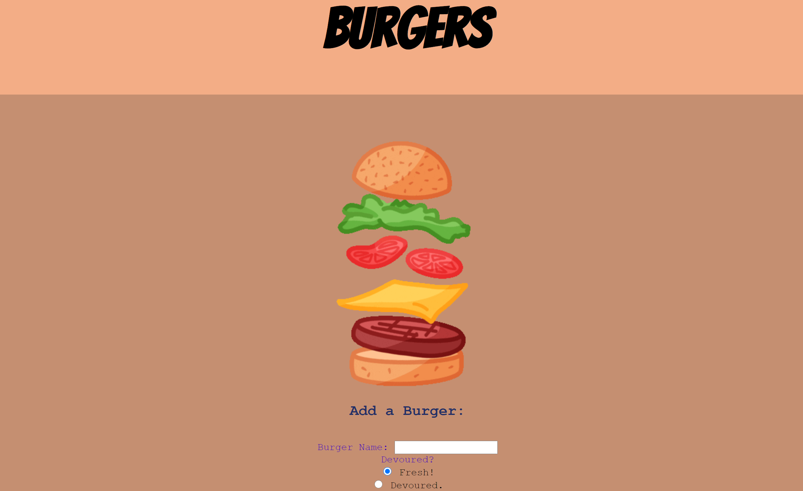
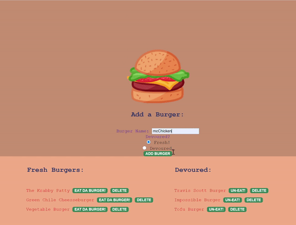

# handle-EDB
## Table of contents

- [General info](#general-info)
- [Technologies](#Technologies)
- [Summary](#Summary)
- [Author](#Author)
- [License](#License)

## Preview

## Table of contents

- [General info](#general-info)
- [Technologies](#Technologies)
- [Summary](#Summary)
- [Usage](#Usage)
- [Expectations](#Expectations)
- [Author](#Author)
- [License](#License)

## General info

Deployed Heroku app using MySQL and JawsDB with timestamp. 

## Technologies

- [JavaScript](https://www.javascript.com/)
- [Node.js](https://nodejs.org/)
- [MySQL](https://www.mysql.com/)
- [JawsDB](https://devcenter.heroku.com/articles/jawsdb)
- [ORM](https://www.js-data.io/docs/what-is-an-orm)
- [Handlebars](https://handlebarsjs.com/)
- [Heroku](https://id.heroku.com/login)
- [package.json](https://docs.npmjs.com/creating-a-package-json-file)
- [npm](https://www.npmjs.com/)
## Summary
Burger app created using multiple technologies to allow users to create and devour fresh burgers!

## Usage
- `$ npm install`
- `$ npm install mysql`
- `$ npm install express`
- `$ npm install util`
- `$ npm install path`
- `$ npm install --save-dev nodemon`
- `$ npm start`

## Expectations

Link to Heroku App : https://limitless-scrubland-83787.herokuapp.com/

## Author

Cheyenne Hunt

## License

Open Source